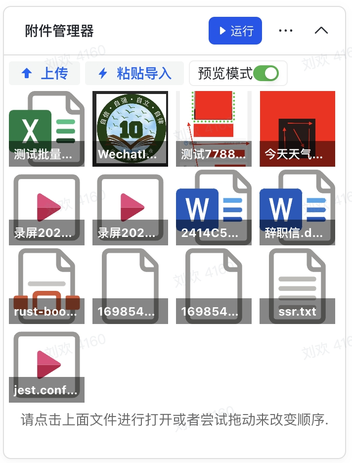

## Base Fileman



### Feature

一个强大的附件管理功能，并且支持多种文件的查看。

附件管理功能

- 上传附件（粘贴导入(支持批量)、拖动导入、点击导入）
- 删除附件
- 修改附件顺序（拖动修改）
- 查看附件详情
- 复制附件链接
- 重命名附件
  查看附件功能
- 媒体文件查看（音频、视频、图片）
- 文档文件查看（office 三件套、PDF）
- 代码文件查看（text、JSON、js、ts...）
  其他暂未实现
- 压缩包查看

### Getting Started

1️⃣ clone deme

```
git clone https://github.com/lib-pack/bs-fileman
pnpm install
pnpm dev
```

2️⃣ 复制 http://localhost:3000/ 到 多维表格 webview 地址
